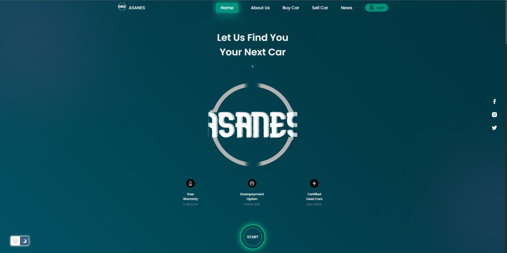
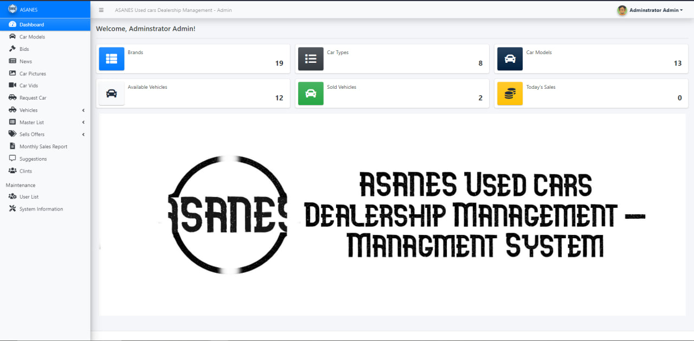

<!-- Improved compatibility of back to top link: See: https://github.com/othneildrew/Best-README-Template/pull/73 -->

<!--
*** Thanks for checking out the Best-README-Template. If you have a suggestion
*** that would make this better, please fork the repo and create a pull request
*** or simply open an issue with the tag "enhancement".
*** Don't forget to give the project a star!
*** Thanks again! Now go create something AMAZING! :D
-->

<!-- PROJECT LOGO -->
 

  

  <h3 align="center">Asanes used cars showroom</h3>

  

Graduation project - Web Application
     
    <a href="https://github.com/asanes19/GraduationProject"><strong>Explore the docs »</strong></a>
     
    <a href="http://asanes.epizy.com/">View Demo</a>
    <a href="https://amazing-pudding-61a0d0.netlify.app/">Video Demo</a>
  

<!-- ABOUT THE PROJECT -->
## About The Project

  

The project is a web application with two sides—a website and a management system—created for a used car showroom. Customers can view available cars on the website, learn about the showroom, sell their cars, request a particular car, and take part in car auctions. The Virtual Test Drive and the 360 Interior Tour are two additional distinctive features on the website. Staff members can control every aspect of the management system, including adding and displaying data about cars and customers, selling cars, and producing monthly reports. A variety of web development tools, including HTML, CSS, JavaScript, PHP, Bootstrap, MySQL, and SiwperJS, were used to create the application. 
A database is connected to the website and management system, enabling effective data management and retrieval. The project aims to improve customer satisfaction and streamline showroom operations, making it simpler for customers to find and buy the cars they want and giving staff efficient management tools.

 

### Built With

  
  

 
 
 

## Customer Website Features

### View Available Cars

Customers can explore a wide range of available cars for sale. The application provides detailed information about each car, including specifications and pricing.

### Learn About Showroom

Get insights into the showroom's services, offerings, and mission. Understand what sets our showroom apart in the used car market.

### Sell Personal Cars

Customers have the option to sell their personal cars through our platform. Easily list and manage your car listings for potential buyers to view.

### Request Specific Cars

Looking for a particular make or model? Customers can submit requests for specific cars based on their preferences, and our system will match their requests with available inventory.

### Participate in Car Auctions

Engage in exciting car auctions where customers can bid on their favorite cars. Experience the thrill of competitive bidding and potentially secure your dream car.

### Virtual Test Drive and 360 Interior Tour

Immerse yourself in the car-buying experience with our Virtual Test Drive and 360 Interior Tour features. Get a close look at the interior and take a simulated test drive without leaving your home.

## Management System Features

### Staff Control

Authorized staff members have full control over the application's management system. Manage cars, customers, sales, and more.

### Car and Customer Data Management

Effortlessly add, update, and display information about cars and customers. Keep track of the latest inventory and customer details with ease.

### Facilitate Car Sales

Staff members can use the application to facilitate car sales efficiently. Manage negotiations, contracts, and paperwork in a streamlined manner.

### Generate Monthly Reports

Our system provides the ability to generate detailed monthly reports for analysis. Gain insights into sales trends, customer preferences, and other key performance metrics.

 

<h3> 🙋‍♀️ Let's Connect </h3>

